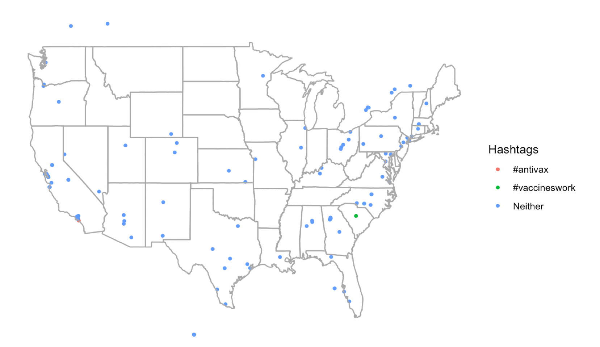

```{r setup, include=FALSE, warnings=FALSE}
knitr::opts_chunk$set(echo = TRUE)
```

# Motivation
It is important to identify communities who are at higher risk of infectious diseases in order to implement preventative measures. In this document, we will classify Twitter users and their tweets as "pro" or "anti" vaccination. 
<center>

</center>
This case study consists of data exploration and visualization using Natural Language Processing techniques, a social network analysis with the `igraph` package, and a sentiment analysis of the results.

The libraries used in this study are listed in the following table, along with their purpose in this particular case study:

|Library|Purpose|
|---|---|
|`stringr`|Parsing text with regular expressions|
|`tidytext`|Loading important datasets and manipulating text data|
|`dplyr`|Dataframe manipulation|
|`ggplot2`|Plotting sentiment|
|`wordcloud`|Creating wordcloud visuals|
|`SnowballC`|Word stemming|
|`igraph`|Performing social network analysis|
|`threejs`|Graphing large-scale social networks (compatible with `igraph`)|
|`visNetwork`|Graphing social networks with labels|

In order to run this code please ensure you have these packages installed. 

If you would like to download your own Twitter data, you will need to sign up for a Twitter developer account, create an application, and enter your own keys & credintials in the "What is the data?" section below.

The learning objectives include data cleaning and manipulation with natural language processing and regular expressions, social network analysis, semi-supervised learning concepts, and sentiment analysis.

# What is the data?
To collect data from Twitter, we suggest using the `rtweet` package. Again, if you would like to download your own Twitter data, you will need to sign up for a Twitter developer account, create an application, and enter your own keys below. We've set the code chunk `eval = false` so that when the entire file is knit the code in the chunk is ignored.

```{r eval=FALSE}
library(rtweet)

twitter_token <- create_token(
  app = "twitter_app_name",
  consumer_key = "XXXXXXXXXXXXXXX",
  consumer_secret = "XXXXXXXXXXXXXXXXXXXXX",
  access_token = "XXXXXXXXXXXXXXXXXXXXXXXXXXX",
  access_secret = "XXXXXXXXXXXXXXXXX")
```
Once the `twitter_token` is create it is stored in the workspace and you are free to use all the functions in `rtweet`!

The `search_tweets` function can download 18,000 every 15 minutes (with the free developer account). However adding `retryonratelimit = TRUE` automatically waits for the rate limit to be reset (after 15 min) and then searches for the remaining tweets. This is repeated until all requested tweets are downloaded.

We search for the 18,000 most recent tweets (`type = "recent"`) that contain the hashtags "antivax" or "vaccineswork", as well as just the word "vaccines". `include_rts = TRUE` means we are including retweets. This is important for this case study: we want to be able to connect users to one another if they share the same opinion. We can assume if a user retweets a tweet without adding any text to it (which might state their opposition to the tweet) then they agree with the tweet.

We set `lang = "en"` to capture only tweets in English.

```{r eval=FALSE}
st <- search_tweets('#antivax OR vaccines OR #vaccineswork', 
                    n = 18000,
                    type = "recent",
                    include_rts = TRUE, 
                    lang = "en")
```

After collecting the tweets with the `rtweet` package, we exported the data as a csv file. This is an important step because the data you collect with the API can be very different every time. It also takes a few minutes to download new tweets.

Before exporting as a CSV we removed the rows that 
```{r eval=FALSE}
for (col in colnames(st))
  {
  if (typeof(st[[col]]) == "list")
    {
    st[[col]] <- NULL
  }
}
```
Next, we'll import a set of data that was created with the exact steps as above.

# Data import
Before doing anything, we should load the libraries needed for the case study.
```{r, message = FALSE}
library(kableExtra)
library(stringr)

library(tidytext)
library(dplyr)
library(ggplot2)
library(kableExtra)
library(tidyr)
library(tm)
library(topicmodels)

library(wordcloud)
library(SnowballC)

library(topicmodels)

library(igraph)
library(threejs)
library(visNetwork)
```

Now we upload the data as a dataframe with `read.csv` and look at all the fields/features/columns by printing out the `colnames`. Each row of the dataframe is information about *one tweet*. We also print out the first row with `head(tweets_df,1)` to get an idea of what kind of information is in each row and column.
```{r}
# tweets_df <- read.csv("data/date01_14_n18k_key2_uuidgens_final.csv",
#                       stringsAsFactors = FALSE,
#                       encoding="UTF-8")

tweets_df <- read.csv("data/date02_13_n5k_key3_uuidgens_final.csv",
                      stringsAsFactors = FALSE,
                      encoding="UTF-8")
colnames(tweets_df)
head(tweets_df,1)
```
In a seperate file, unique IDs were generated for each user so that all identifiers could be removed in order to avoid assuming or exploiting any political or religious views and/or the state of someone's health.

We describe a few of the important columns in the following table:

For each row $i$,

|Column|Description|
|--|---|
|`text`|Raw text from tweet $i$|
|`uuidgens_user`|Unique ID of the user who tweeted (or retweeted) tweet $i$|
|`uuidgens_retweet`|Unique ID of the user that tweet $i$ was *retweeted from*|
|`created_at`|Date and time tweet $i$ was tweeted|
|`display_text_width`|Number of characters in tweet $i$|
|`location`|Location the tweeting user has listed in their Twitter bio|
|`description`|Description the tweeting user has listed in their Twitter bio|
|`long` and `lat`|Longitude and lattitude coordinates|


# Data wrangling
## Cleaning with regular expressions
Using regular expressions to parse and clean text is an important skill when dealing with text data. Let's take a look at the data to see what we need to clean by printing the head, or first 6 lines, of the `text` column - the raw text from the tweets we downloaded.

```{r}
head(unique(tweets_df$text))
```

We want to remove text that does not aid our analysis and may in fact distract from our analysis. For example, we observe lots of links that begin with "https..." that aren't giving us any insightful information.

The string `pat` below contains several regular expression or "regex" patterns that match with a few different unwanted characters or phrases.

|Regex Phrase|Text match|
|---|---|
|`[\r\n]`|Newline character|
|`&amp.`|"&amp" phrase|The "." matches any character|
|`@.*?\\S+`|Tagged user handle followed by whitespace|
|`@.*?$`|Tagged user handle at the end of the tweet|
|`https?:.*\\S+`|Embedded link followed by whitespace|
|`https?:.*$`|Embedded link at the end of the tweet|
|`[^[:alnum:][:blank:]?&/\\-]`|Meant to remove UTF-8 characters|

Looking at the code chunk below, we note that the "|" character seperates each pattern in `pat`. When `str_replace_all` is called, it checks for matches with *every seperate pattern* in `pat` and looks for repeats of any pattern. Each match with one of the patterns is replaced with an empty string, `""`.

We replace the `tweets_df` columns `text` and `retweet_text` with the cleaned versions of the columns, and then print the head of the `text` collumn to view our changes.


old stuff : Let's clean up the data by removing "@username:" because we don't want to include usernames. We can use regular expression to remove the unwanted text. By looking at a few of the tweets, we can see that we need to delete everything beginning with "RT @" and ending with ":" at the beginning of retweeted tweets. Additionally, many users tag other users within their tweets. We should remove the tags elseware as well.

In regular expression "." can match with any character except for newline `\n`. The "`*`" character matches 0 or more of the previous character, which in the case below is the ".". The "?" quantifyer is *non-greedy*, meaning it matches as few characters as possible. We want to include this so that we remove the minimum amount of text. Thus, `"@.*? "` matches with the username that is retweeted or tagged. Note that a space is included at the end because usernames end before the space.


```{r}
pat <- "[\r\n]|&amp.|@.*?\\S+\\S+|@.*?$|https?:.*\\S+|https?:.*$|[^[:alnum:][:blank:]?&/\\-#.]"

tweets_df <- tweets_df %>% 
  mutate(text = str_replace_all(text, pattern = pat, "")) %>%
  mutate(retweet_text = str_replace_all(retweet_text, pattern = pat, ""))

head(tweets_df$text)
```
Let's remove the duplicated tweets.

As we can see above, there are some spaces leftover. So let's find the unique strings where all the words are smushed together.

```{r}
pat <- ' '
tweets_df <- tweets_df %>% 
  mutate(nospace = str_replace_all(text, pattern = pat, "")) %>%
  filter(!duplicated(nospace))
head(tweets_df$text)
```


## The tidy text and NLP

The tidy text format is using **one-token-per-row** in our dataframe. In short, tokens in natural language processing are words. To be technical, you could say a token is a list of characters between two spaces. Tokenization is the process of breaking up a string or paragraph or document into tokens.

We want to tokenize our tweets, however we don't want to lose any information. Specifically, we want to keep track of what Tweet each word came from since our analysis involves differentiating tweets. Other analyses including topic summarization may not require keeping track of this--you can just a create a jumble (i.e. "corpus") of words and find commonalities.

We create the dataframe `text_df` with one column of the twitter `text` and add the `int` column as an index for the tweets. We then tokenize the text data with tidytext's `unnest_tokens` by using the `text` column as the input and `word` as the name of the output column. We replace `text_df` with this newly formatted dataframe.

```{r}
text_df <- tweets_df %>% 
  select(text)
text_df$int <- c(1:length(text_df$text))

text_df <- text_df %>%
    unnest_tokens(word, text)

head(text_df)
```
Now that we have our data in a useful format, we want to remove stop words from the text. *Stop words* in NLP are common words that don't add value to a sentence, paragraph, document etc. For example, "still think the flu shot is..." doesn't give us any extra information than "still think flu shot," so we can remove these words to make our dataset more concise.

To do this, simply load the `stop_words` dataset, which has two columns: `word` and `lexicon`. There are three different lexicons that reference the *source* of the stop word:

- ["onix"](http://www.lextek.com/manuals/onix/stopwords1.html)

- ["SMART"](http://www.jmlr.org/papers/volume5/lewis04a/lewis04a.pdf)

- ["snowball."](http://snowball.tartarus.org/algorithms/english/stop.txt)

The difference between the lexicons is they include different words. Some include more than others, thus if we use these we remove more words and from our data. To quickly see these differences, we can count the number of stop words in each category using `dplyr`'s `group_by`.
```{r}
data(stop_words)
head(stop_words)

stop_words %>% 
    group_by(lexicon) %>% 
    tally()
```

Since we have no prior reason to chose a specific lexicon, let's remove all of the stop words in the `stopwords` dataset from our data using the `anti_join` function. We can always modify this later on.
```{r}
text_df <- text_df %>%
  anti_join(stop_words)

head(text_df,10)
```
But wait...we've removed words such as "not", which negate terms and change the meaning from "not like" to "like," which has very different sentiment. We will look at how to handle this later.

## Stemming
Another technique often used alongside removing stopwords is word *stemming*. Stemming changes each word to a root word so that different conjugations of the same word are not treated as different words completely. A human can tell that "vaccine", vaccinate" and "vaccination" have similar meaning. However if we were to count every repetition of "vaccine" in R we would not get an accurate total since "vaccination" would be ignored, for example. Instead, we change each of those words to "vaccin" with a stemming algorithm.

We will use the library `SnowballC` which implements the [Porter stemming algorithm](http://snowball.tartarus.org/algorithms/porter/stemmer.html).

```{r}
text_df <- text_df %>%
  mutate(word = wordStem(word))
head(text_df,10)
```

# Exploratory data analysis

## Topic Modeling
Convert to document term matrix
```{r}
dtm_df <- text_df %>%
  group_by(int, word) %>%
  tally()

head(dtm_df)

text_dtm <- dtm_df %>%
  cast_dtm(int, word, n)

terms <- Terms(text_dtm)
head(terms)
```
Apply Latent Dirichlet allocation
```{r}
ap_lda <- LDA(text_dtm, k = 2, control = list(seed = 1234))
ap_lda

ap_topics <- tidy(ap_lda, matrix = "beta")
head(ap_topics)
```
```{r}
ap_top_terms <- ap_topics %>%
  group_by(topic) %>%
  top_n(20, beta) %>%
  ungroup() %>%
  arrange(topic, -beta)

ap_top_terms %>%
  mutate(term = reorder(term, beta)) %>%
  ggplot(aes(term, beta, fill = factor(topic))) +
  geom_col(show.legend = FALSE) +
  facet_wrap(~ topic, scales = "free") +
  coord_flip()
```
```{r}
beta_spread <- ap_topics %>%
  mutate(topic = paste0("topic", topic)) %>%
  spread(topic, beta) %>%
  filter(topic1 > .005 | topic2 > .01) %>%
  mutate(log_ratio = log2(topic2 / topic1))

beta_spread
```
```{r}
beta_spread %>%
  mutate(term = reorder(term, log_ratio)) %>%
  ggplot(aes(term, log_ratio, fill = factor(term))) +
  geom_col(show.legend = FALSE) +
  coord_flip()
```

Examine group probabilities by tweet
```{r}
ap_tweets <- tidy(ap_lda, matrix = "gamma")
ap_tweets<-ap_tweets %>% arrange(desc(gamma))
head(ap_tweets,20)

# get_diff <- ap_tweets %>% 
#   group_by(document) %>%
#   mutate(gamma_dif = max(gamma)-min(gamma)) %>%
#   arrange(desc(gamma_dif))

#aptweets_gmax <- ap_tweets[dim(ap_tweets)[1]/2,]
#aptweets_gmax <- aptweets_gmax %>%
#  mutate(topic1 = ifelse(gamma ))
```
Now look at the actual tweets...
```{r}

kable(tweets_df$text[as.numeric(ap_tweets$document[1:20])]) %>%
  kable_styling("striped", full_width = F) %>%
  row_spec(c(4:6,10,12,13,15,17:20), bold = T, color = "white", background = "grey")
```

Ok - this isn't perfect; 


```{r echo = FALSE}
anti_lst <- as.numeric(
  grepl("antivax", tweets_df$text))
pro_lst <-as.numeric(
  grepl("provax", tweets_df$text))

tweets_df$Hashtags <- "Neither"
tweets_df$Hashtags[anti_lst == 1] <- "#antivax"
tweets_df$Hashtags[pro_lst == 1] <- "#provax"
```


```{r, message=FALSE, warning=FALSE, eval=FALSE}
library(ggplot2)
library(ggmap)

states <- map_data("state")

ggplot(data = states) + 
  geom_point(data = tweets_df, aes(x = lng, y = lat,  colour = Hashtags), size = 1) +
  geom_polygon(aes(x = long, y = lat, group=group), fill = NA, color = "dark grey") +
  theme_void()

sum(is.na(tweets_df$lat) ==FALSE)/dim(tweets_df)[1]*100
```

A common NLP data exploration practice is looking at unigram frequencies.
*N-grams* are sequences of N items/tokens. Common n-grams that are used in NLP are unigrams, bigrams, and trigrams.

We find the top 10 most common words or unigrams to see common topics in our data. Recall that we have already removed stopwords and unnecessary items such as web links, and we have stemmed the remaining words.

```{r}
head(text_df %>%
       count(word, sort = TRUE),10)
```

We can graph the unigram frequencies with ggplot for a nice visualization of our text data. We pick a number of appearances to filter smaller than the total tweets we have (5,000) to plot only the top few words.
```{r}
text_df %>%
  count(word, sort = TRUE) %>%
  filter(n>100) %>%
  mutate(word = reorder(word, n)) %>%
  ggplot(aes(word, n)) +
  geom_col() +
  xlab(NULL) +
  ylab(NULL) +
  coord_flip()
```

Next, we can look at common *bigrams*, which are two words in a row. The tidytext function `unnest_tokens` is an effient way to find bigrams by setting `token = "ngrams"` and `n = 2`. The output column is named "bigram".

To get the most frequent bigrams we can simply use the `dplyr` library's `count` function again.
```{r}
bigrams <- text_df %>%
  unnest_tokens(bigram, word, token = "ngrams", n = 2)

head(bigrams)

head(bigrams %>%
  count(bigram, sort = TRUE),10)
```


For another fun exploration graphic, try word clouds
```{r}
library(wordcloud2)
text_df %>%
  count(word) %>%
  with(wordcloud(word, n, max.words = 100))
test<- text_df %>%
  count(word) %>%
  arrange(desc(n))

#test <- head(test,100)
#test$n <- "freq"
#rownames(test) <- test$word
#library(wordcloud2)
#wordcloud2(test, figPath = "twitter.jpg")
#figPath = system.file("examples/t.png",package = "wordcloud2")
#wordcloud2(test, figPath = figPath, color = "skyblue")
```

## Sentiment
We want to classify the tweets by sentiment, or rather by the feelings and emotions portrayed by the user. As humans we can easily tell if someone is angry, sad, satisfied, or even sarcastic. However we have to give the computer some clues on how to do this start with the `sentiments` dataset which is loaded with the `tidytext` library. Similar to the `stop_words` dataset, there are three lexicons:

* `afinn` gives each word an integer score between -5 and 5, from most negative to most positive sentiment.

* `bing` gives a binary "negative" or "positive" sentiment to each words.

* `nrc` assigns sentiment labels of "positive, negative, anger, anticipation, disgust, fear, joy, sadness, surprise, and trust."

We can also use the tidytext's `get_sentiments()` function to only get data from a particular lexicon.

```{r}
head(sentiments)
head(get_sentiments('afinn'))
```
"How were these sentiment lexicons put together and validated? They were constructed via either crowdsourcing (using, for example, Amazon Mechanical Turk) or by the labor of one of the authors, and were validated using some combination of crowdsourcing again, restaurant or movie reviews, or Twitter data. Given this information, we may hesitate to apply these sentiment lexicons to styles of text dramatically different from what they were validated on, such as narrative fiction from 200 years ago. While it is true that using these sentiment lexicons with, for example, Jane Austen’s novels may give us less accurate results than with tweets sent by a contemporary writer, we still can measure the sentiment content for words that are shared across the lexicon and the text."
(note to self)

Next let's merge some of our data with the sentiment lexicon "afinn" to explore our text.
```{r}
nrc_example <- get_sentiments("afinn") %>% 
  filter(score == -2)

head(text_df %>%
  inner_join(nrc_example) %>%
  count(word, sort = TRUE),10)
```
We note that sentiment analysis would not be straight-forward. From the text printed above, we can't exactly pinpoint if the user is being negative about vaccinations, or the effects of not getting vaccinated, or just being negative about the anti-vaccination or vaccination communities.

Let's plot the average `afinn` scores for each tweet to explore the overall sentiment of our data.

```{r,message=FALSE}
library(tidyr)

tweet_sentiment <- text_df %>%
  anti_join(stop_words) %>%
  inner_join(get_sentiments("afinn")) %>%
  group_by(int) %>%
  mutate(text = paste0(word)) %>%
  summarize(sentiment_mean = mean(score))

tweet_sentiment_ordered <- tweet_sentiment[order(tweet_sentiment$sentiment_mean),] 
head(tweet_sentiment_ordered)

tweet_sentiment_ordered$int <- factor(tweet_sentiment_ordered$int, levels = tweet_sentiment_ordered$int)

ggplot(tweet_sentiment_ordered, aes(sentiment_mean)) +
  geom_histogram(show.legend = FALSE, binwidth = .3) +
  ggtitle("Mean afinn sentiment score per tweet") + 
  geom_vline(xintercept = 0, linetype = "dashed", colour = "red") +
  ylab(NULL)
 # #facet_wrap(~book, ncol = 2, scales = "free_x")


```
Remember when we said we should consider the negation issue? As in, how can we distinguish between the sentiment of "not like" and "like"?


Let's print out some positive tweets. We can use the index column "int" that we've kept constant to print out the original (sans and Twitter handles) tweets.

```{r}
positive <- tweet_sentiment$int[tweet_sentiment$sentiment_mean > 2]
head(tweets_df$text[positive])
```
And let's look at some negative ones as well..
```{r}
negative <- tweet_sentiment$int[tweet_sentiment$sentiment_mean < -2 ]
head(tweets_df$text[negative])
```
Neither the positive nore negative tweets are unanamously on either side of this "issue"", even with this small sample of text. Now we can really see how this won't be easy!

We should think about what we can do about the words that won't be found in the `sentiments` dataset, like "#vaccineswork" that might give us even more information about whether or not the tweet is supporting vaccines or not.

Sentiment may be just a small part of clustering tweets as "pro-vaccination" or "anti-vaccination."

http://www.public.asu.edu/~huanliu/papers/sbp14.pdf

# Data analysis


Throughout our data exploration, we realized the problem we are solving is not quite what we started with. This is not a sentiment analysis: this is classifying tweets as one of two sides of a debate. 

Assuming that, with high probability, users do not change their views--expecially within a 7-day window, we can label Twitter users and represent them as a *social network* to help classify tweets.

To do this, we will use the power of retweets and seed users, or prominent figures that clearly have one opion or another.For example, the World Health Organization and CDC are two entities that would produce pro-vaccination tweets. The data we have also contains reply tweets, but we cannot count on these to identify similar opinion because users may reply to tweets they agree with or tweets they do not agree with. We use Retweets because we can assume that if a user retweets another users tweets about vaccination, they probably agree with their opinion. This assumption gets stronger as the social network grows more connections.

## Label propagation
We will build a network using the `igraph` package. This network will have users as nodes or vertices, with an edge between two vertices if the users retweet the same tweet, are following or are friends with the other user, or retweeted a tweet directly from the other user. The weight of the edge will increase if more than one of the previous are true.

First, we should create a data frame where the first two columns are vertices with an edge between them. 

add attributes if there are multiple connections necessary.

```{r eval = FALSE}
#tweets_df <- tweets_df[sample(nrow(tweets_df), 5000), ]
tweets_df <- tweets_df %>% 
  mutate(tweet_factor = 
           as.numeric(factor(text)) )

l <- list()

for (i in c(1:max(tweets_df$tweet_factor))){
  users <- unique(c(tweets_df$uuidgens_user[tweets_df$tweet_factor==i],
                    tweets_df$uuidgens_retweet[tweets_df$tweet_factor==i]))
  users <- users[is.na(users) == FALSE]
  l <- append(l, list(users))
}

```
Now we have each tweet on the list with the associated users. Now let's create an edge between all these users by creating the dataframe that will be converted to a graph object with `igraph`.
```{r eval = FALSE}
graph_df <- matrix(ncol=2, nrow=2000000)
index = 1

for (i in c(1:length(l))){  #length(l)
  if (length(l[[i]]) > 1){
    combos <- t(combn(l[[i]],2))
    graph_df[c(index:(index + length(combos[,1])-1)),] <- combos
    
    index = index + length(combos[,1]) 
  }
}

graph_df <- as.data.frame(graph_df)
```

Let's delete the extra room
```{r eval = FALSE}
graph_df<-graph_df[is.na(graph_df$V1) == FALSE,]
dim(graph_df)
```

So now we've connect each user to all of its tweets, and each unique tweet to all unique users that retweeted it.
```{r eval = FALSE}
graph_df$V1 <-  as.character(graph_df$V1)
graph_df$V2 <-  as.character(graph_df$V2)

graph_df <- graph_df %>%
  group_by(V1,V2) %>%
  tally()

dim(graph_df)

df1 <- data.frame(t(apply(graph_df[1:2], 1, sort)), graph_df[3])
graph_df <- aggregate(n~., df1, FUN=sum)

#dim(graph_df)
#head(graph_df)
```


Next we add a *vertex attribute* because we have inferred the label of a few users are friends with the seed users.

We import the dataframe with seed user friends as `seeds_df`. The column `pro_vax` = 1 if the user is followed by the World Health Organization and 0 if the user is followed by HealthRanger.

```{r eval = FALSE}

vtx_df <- data.frame("unique_vtcs" = unique(c(graph_df$V1, graph_df$V2)))

seeds_df <- read.csv("data/seeds_WHO_HR_friends.csv", stringsAsFactors = FALSE)

vtx_df <- merge(vtx_df, seeds_df, by.x = "unique_vtcs", by.y = "uuidgens_user", all.x = TRUE, all.y = FALSE)
vtx_df$pro_vax[vtx_df$pro_vax == 0] <- 2 # label anti vax users with a 2 instead of 0

head(vtx_df)
```
Set remaining vertices to -1 so they are ignored (initialized vertices)
```{r eval = FALSE}
vtx_df$pro_vax[is.na(vtx_df$pro_vax)] <- -1
vtx_df$fix <- with(vtx_df, pro_vax > 0)
#vtx_df %>% filter(pro_vax == 2) %>% filter(fix == FALSE)

g <- graph_from_data_frame(d = graph_df, directed = FALSE, vertices = vtx_df)
edge_width <- (E(g)$n)**2
```

Run label propagation, Add vertex attriutes and color the largest communities.
```{r eval = FALSE}
clp <- cluster_label_prop(g, weights = edge_width)#, fixed = vtx_df$fix)

# create some vertex attributes
V(g)$community <- clp$membership
head(E(g)$n)

#V(g)$betweenness <- betweenness(g, v = V(g), directed = F)
#V(g)$degree <- degree(g, v = V(g))
```
Data visualization
```{r eval = FALSE}
data <- toVisNetworkData(g)
nodes <- data[[1]]
edges <- data[[2]]

edge_width <- (E(g)$n)**2

library(RColorBrewer)

get_big_coms <- nodes %>% 
  select(community) %>% 
  group_by(community) %>% 
  tally() %>%
  arrange(desc(n))

biggest_groups<- get_big_coms$community[1:2]

col <- rep("grey", length(V(g)))
colors<- brewer.pal(10, "Paired")

for(j in c(1:2)){
  col[V(g)$community == biggest_groups[j]] <- colors[j]
}
```

Now let's great the graph
```{r eval = FALSE}
graphjs(g, vertex.color = col,  vertex.size = .3,  edge.width = edge_width, na.ok = TRUE)
```


Let's play around with the vertex attributes in a data frame. We can look at the pro-vax and anti-vax labels and see what communities they ended up in. Then let's color those communities.
```{r eval=FALSE}
vtxattr_df <- data.frame(vertex_attr(g))
#head(vtxattr_df)
vtxattr_df %>% filter(pro_vax == 1) %>% select(community) %>% group_by(community) %>% tally()
vtxattr_df %>% filter(pro_vax == 2) %>% select(community) %>% group_by(community) %>% tally()

pro_communities<- vtxattr_df %>% filter(pro_vax == 1) %>% select(community) %>% group_by(community)# %>% tally()
anti_communities<- vtxattr_df %>% filter(pro_vax == 2) %>% select(community) %>% group_by(community)# %>% tally()

#vtxattr_df %>% filter(community == 104) %>% tally()
#vtxattr_df %>% filter(community == 1194) %>% tally()

```

```{r eval = FALSE}
cfg <- cluster_fast_greedy(g)
V(g)$cfgcommunity <- cfg$membership
```


```{r eval = FALSE}
library(RColorBrewer)

col <- rep("grey", length(V(g)))
colors<- brewer.pal(10, "Paired")

for(i in pro_communities){
  col[V(g)$community == i] <- colors[1]
}

for(i in anti_communities){
  col[V(g)$community == i] <- colors[2]
}

#graphjs(g, vertex.color = col,  vertex.size = .3, na.ok = TRUE)
```


# Summary of results
```{r eval=FALSE}
(labeled <- 100*(1 - sum(col == "grey")/length(col)))
(pro_labeled <- 100*sum(col == colors[1])/length(col))
(anti_labeled <- 100*sum(col == colors[2])/length(col))
```
About r labeled 10% of our data is labeled!

r pro_labeled is pro vax while r anti_labeled is antivax

```{r eval=FALSE}
vtxattr_df$colors <- col
new_provax <- vtxattr_df %>% filter(is.na(pro_vax)) %>% filter(colors == col[2]) %>% select(name)
new_provax[sample(nrow(new_provax), 10), ]
```


